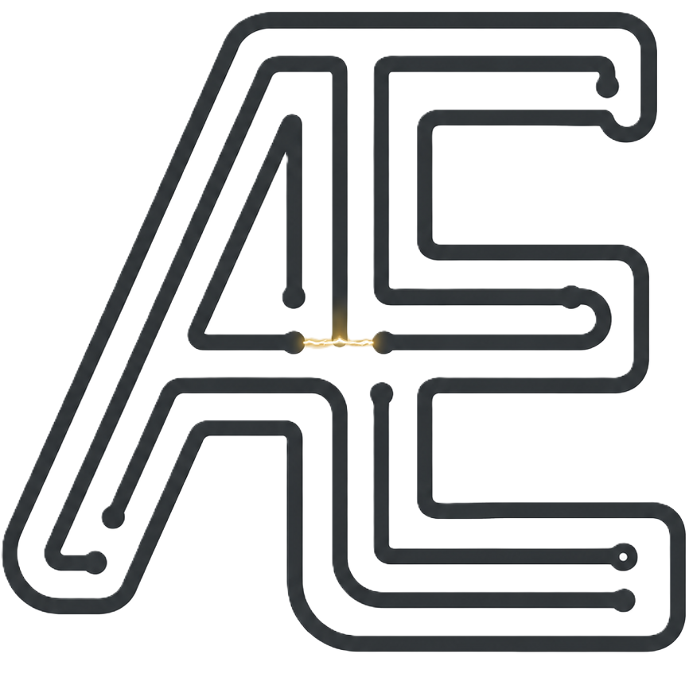
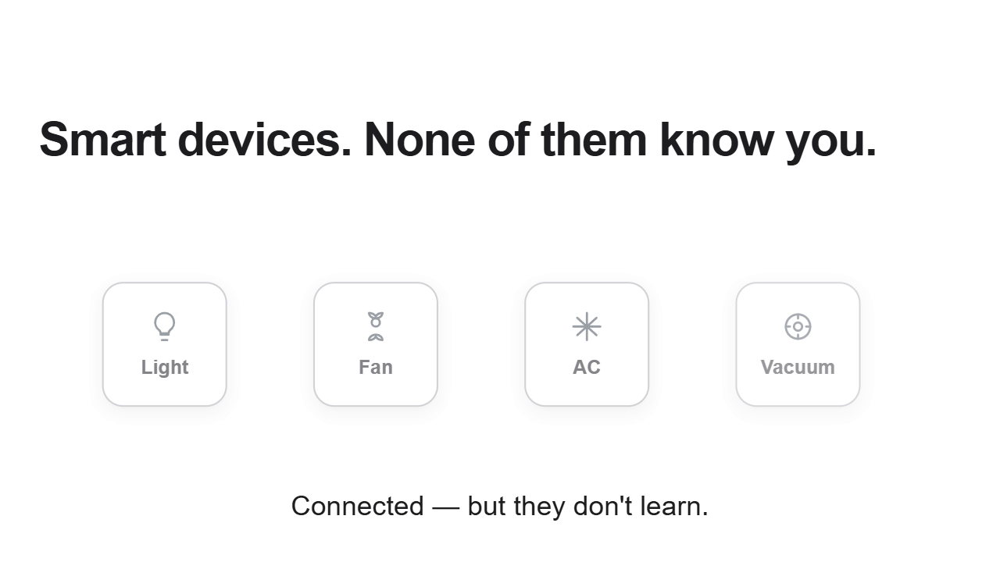
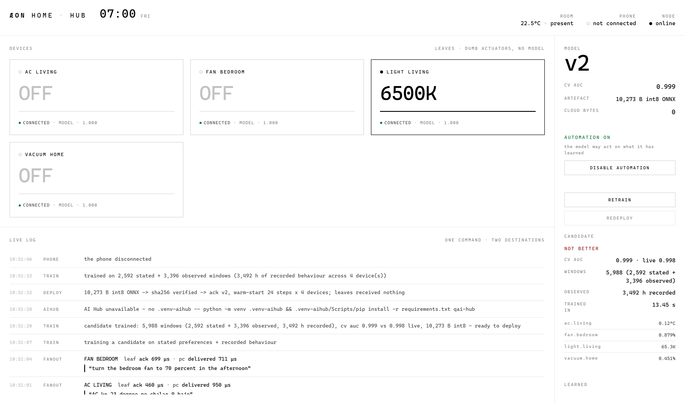
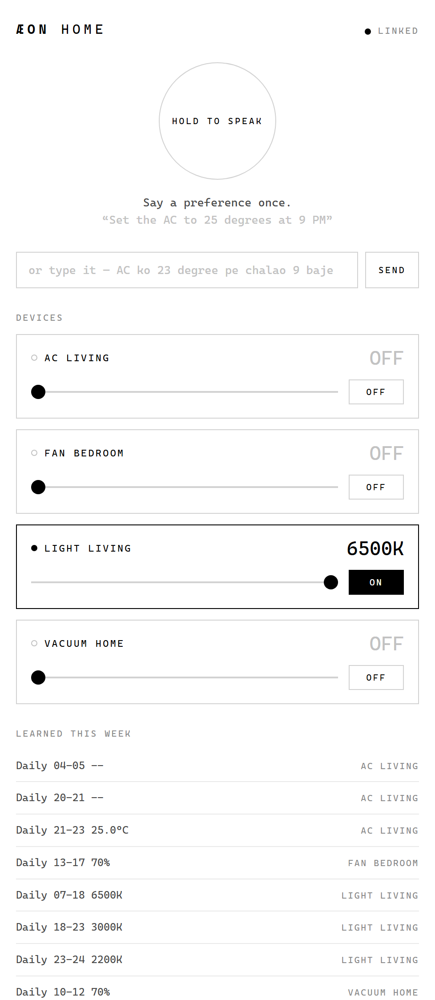
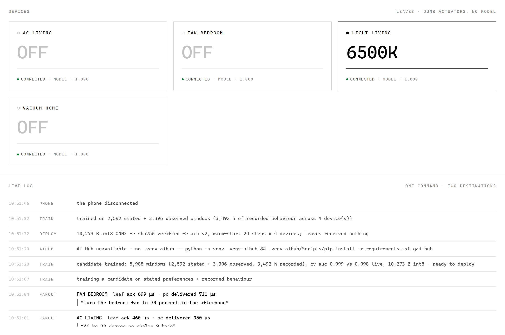
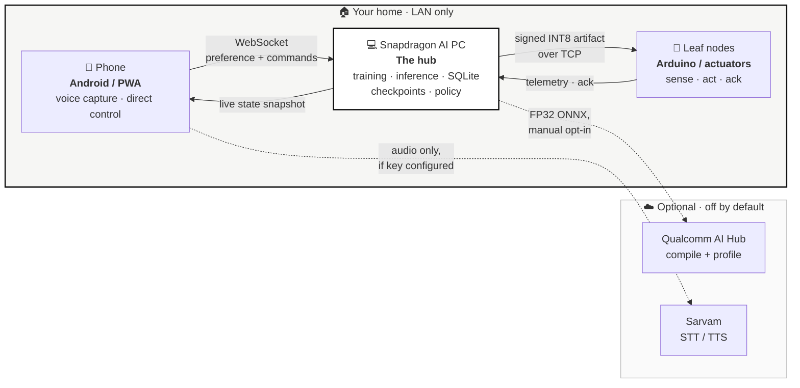
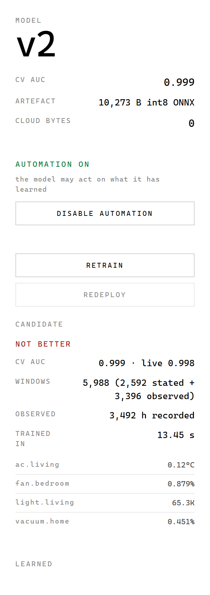

<div align="center">



# ÆON Home

### Computers forget. ÆON remembers.

**A persistent, offline-first home intelligence system that learns your habits on the edge — and keeps them through a power cut.**

Built for the **Snapdragon Multiverse Hackathon 2026**, Qualcomm Noida.

[](LICENSE)
[](https://www.python.org/)
[](https://nodejs.org/)
[](https://onnxruntime.ai/)
[](https://aihub.qualcomm.com)

</div>

---

## Demo

<div align="center">

<a href="https://github.com/gtathelegend/AEON-HOME/raw/main/assets/aeon-home-demo.mp4">
  
</a>

### ▶ [Watch the 71-second demo](https://github.com/gtathelegend/AEON-HOME/raw/main/assets/aeon-home-demo.mp4)

</div>

The film runs the whole arc in a minute: *smart devices that never learn you* → an Arduino quietly logging behaviour with **no cloud** → a routine the system noticed on its own → and the part we care most about, **"nothing deploys until you say yes."** That last line is not a slogan; it is the two-button retrain/redeploy gate described [below](#the-deployment-gate).

---

## The problem

Smart homes today are neither smart nor yours.

1. **They forget.** India's tier-2 and tier-3 cities see 3–5 hours of daily power cuts. When the power returns, every "smart" device cold-boots from zero and its learned behaviour is gone. Your home starts over, every single day.
2. **They leak.** Mainstream platforms stream raw sensor data to a cloud you don't control — an awkward fit with the **DPDP Act 2023**, and a hard sell to anyone who doesn't want a microphone-shaped subscription in their living room.
3. **They don't share a brain.** Your phone, your PC and your thermostat each hold a different, partial idea of who you are. Nothing is portable.
4. **They need the internet to turn on a fan.** If the link drops, so does the automation.

These aren't bugs. They're consequences of treating intelligence as a cloud service rather than an edge-native property.

## What we built

ÆON Home is a **home intelligence hub that runs entirely on your LAN**. You state a preference once — in English or Hinglish — and the system learns the pattern, trains a small neural network on the AI PC, quantizes it to INT8, and ships the signed artifact to the nodes that actually act.

Four things make it different:

| | |
|---|---|
| **Speak once, not every time** | *"AC ko 23 degree pe chalao 9 baje"* becomes a learned schedule, not a one-off command. The next night, nobody has to ask. |
| **Survives the power cut** | Execution state is checkpointed continuously. On the run pictured below, the hub restored its full state from checkpoint in **2.17 ms** at boot — sequence counter, policy version and all. |
| **Nothing leaves the house** | Sensor and usage history stay in SQLite on the AI PC. The dashboard carries a live **cloud bytes: 0** counter you can watch during the demo. |
| **The model is on probation, always** | A newly trained candidate does not ship because it is new. It ships only if it beats the incumbent on the current data — and you press the button. |

---

## What it looks like

### The hub — AI PC dashboard

The whole system on one screen: live device state on the left, the model's provenance on the right, and every decision the house makes in the log at the bottom.



This screenshot is from a real run, not a mockup. Reading it:

- **Devices** — four appliances, each showing live state and the confidence behind it. They are deliberately labelled *"leaves · dumb actuators, no model"*: the intelligence lives in the hub, the leaves just obey.
- **Live log** — the audit trail. You can see a Hinglish sentence arrive and fan out to two destinations (`leaf ack 460 µs · pc delivered 950 µs`), then a training run, then a deployment.
- **Model panel** — version, cross-validated AUC, artifact size, and a cloud-bytes counter pinned at zero.
- **Candidate panel** — the freshly trained model, scored against the live one, with per-device mean absolute error. Here it reads **NOT BETTER**, so `REDEPLOY` stays disabled. That is the safety gate doing its job.

### The phone — voice and direct control



Hold to speak, or type. The placeholder is Hinglish on purpose — this is built for how people in Indian homes actually talk. Below the mic: direct sliders for every appliance, and the schedule the system has learned this week.

### The retrain → redeploy pipeline, close up



The sequence captured above, in order:

```
TRAIN   training a candidate on stated preferences + recorded behaviour
TRAIN   candidate trained: 5,988 windows (2,592 stated + 3,396 observed,
        3,492 h recorded), cv auc 0.999 vs 0.998 live, 10,273 B int8
        - ready to deploy
DEPLOY  10,273 B -> sha256 verified -> ack v2, warm-start 24 steps x 4 devices
```

Every number there was produced by the run, not typed into a slide.

---

## Multi-device orchestration

Three device tiers in the home, one shared brain, no cloud in the control loop.



**One command, two destinations.** When you speak a preference, the hub does two things at once: it dispatches the command to the leaf *now*, and it records the preference as training data for *later*. The live log timestamps both paths separately — on the run above, the leaf acknowledged in **460 µs** while the PC recorded in **950 µs**.

**The phone never talks to the appliance.** It talks to the hub. That is what keeps a single, consistent idea of the home rather than several devices disagreeing.

**Discovery is automatic.** The hub listens for `AEON?` on UDP `8801`, so the phone finds it on the LAN without anyone typing an IP address.

---

## The model

### What goes in — 106 features

Every inference is over a **24-hour rolling window**, not an instantaneous reading. That is what lets the system learn *"warm light after 8 PM"* rather than *"warm light because it is warm light right now."*

| Block | Size | Contents |
|---|---:|---|
| **Temporal window** | 96 | 24 hourly steps × 4 channels: `on` (0/1), `level` (normalised to −1…1), `occupancy` (0/1), `ambient` (`(°C − 28) / 8`) |
| **Context** | 6 | `sin/cos(hour)`, `sin/cos(day-of-week)`, `is_weekend`, ambient z-score |
| **Device identity** | 4 | one-hot over `ac.living`, `fan.bedroom`, `light.living`, `vacuum.home` |
| **Total** | **106** | fed as a single `float32[1, 106]` tensor |

A single pooled model serves all four appliances — the one-hot tells it which one it is reasoning about. Levels are normalised per device from their real ranges: AC 16–30 °C, fan 0–100 %, light 2200–6500 K, vacuum 0–100 %.

### The network

Two heads sharing an input, trained separately and exported into one ONNX graph:

```
                     ┌─→ Dense(106→32) → tanh → Dense(32→1) → sigmoid → p_on
  input[1, 106] ─────┤
                     └─→ Dense(106→32) → tanh → Dense(32→1) →         → level
```

| | |
|---|---|
| Framework | scikit-learn `MLPClassifier` + `MLPRegressor` |
| Hidden units | 32 per head, `tanh` |
| Optimiser | Adam, `max_iter=3000`, early stop after 25 stale iterations |
| **Parameters** | **6,914** (2 × (106×32 + 32 + 32 + 1)) |
| Export | hand-built ONNX graph, opset 13 — `MatMul → Add → Tanh → MatMul → Add [→ Sigmoid]` |

It is deliberately small. A 6,914-parameter model trains in seconds on the AI PC and quantizes to ~10 KB, which keeps the retrain-and-redeploy loop fast enough to run live in front of you — and small enough to be a realistic target for constrained hardware. For this problem, turnaround matters more than capacity.

### What comes out

| Output | Shape | Meaning |
|---|---|---|
| `p_on` | `[1,1]` | probability the appliance should be on |
| `level` | `[1,1]` | normalised setting, denormalised to the device's own unit |

Those two numbers become an action through a **three-way confidence gate**, so the system knows the difference between *knowing* and *guessing*:

| Confidence | Action | Behaviour |
|---|---|---|
| ≥ 0.75 | **act** | switch it, log it |
| ≥ 0.40 | **ask** | surface it, don't act |
| < 0.40 | **abstain** | stay quiet |

Two hard overrides run *after* inference and can only ever turn things off: an empty room forces `off_when_empty` devices off, and the automation consent switch can withhold actuation entirely. Note that consent-off does not stop *learning* — preferences are still parsed and recorded, so switching automation back on resumes on a warm window instead of a blind one.

### How it is trained

Training data comes from two sources, pooled:

1. **Stated preferences** — every sentence you have spoken, expanded into 28 days × 24 hourly steps of intent.
2. **Observed behaviour** — what the appliances actually did, reconstructed from the event-sourced `usage` table in SQLite.

On the run screenshotted above: **5,988 windows** = 2,592 stated + 3,396 observed, over **3,492 hours** of recorded behaviour, trained in **13.45 s**.

### The deployment gate

This is the part we are most proud of. A candidate model must clear **three** independent checks before the `REDEPLOY` button even becomes clickable:

| Gate | Threshold |
|---|---|
| Enough data | ≥ 200 training windows |
| Generalises | 3-fold stratified **CV AUC ≥ 0.60** |
| **Beats the incumbent** | re-scores the *currently deployed* model on the *current* dataset and must win |



In the panel on the right the candidate scored **0.999 against 0.998 live** — statistically a wash. So the verdict reads **NOT BETTER** in red and `REDEPLOY` is greyed out. The system will not let you ship it.

That is the gate working, and we left it in the screenshot deliberately. A demo that only ever shows success isn't demonstrating a safety mechanism; this one refuses on camera.

Underneath, the candidate reports exactly why it was rejected: how many windows it trained on, how many hours of real behaviour those represent, how long it took, and the per-device level error it would introduce.

Training and deploying are **two separate buttons** on purpose. The model never promotes itself, and neither does a good demo.

<br clear="right" />

---

## Quantization

Deployment artifacts are INT8, produced with ONNX Runtime's dynamic quantizer:

```python
from onnxruntime.quantization import QuantType, quantize_dynamic

quantize_dynamic(
    model_input=str(src),
    model_output=str(dst),
    weight_type=QuantType.QInt8,
)
```

To be precise about what this is: **weight-only, post-training dynamic quantization to signed INT8.** Activations are quantized at runtime, so no calibration dataset is required. It is not QAT, and not static per-channel PTQ.

**Quantization is verified, not assumed.** Before an INT8 artifact is eligible to ship, it is run head-to-head against its FP32 parent and must agree:

| Check | What it compares |
|---|---|
| `max_p_on_delta` | worst-case probability drift |
| `mean_p_on_delta` | average probability drift |
| `max_level_delta` | worst-case level drift |
| `decisions_identical` | **do FP32 and INT8 produce the same on/off decisions?** |

The last one is the one that matters — a model that is numerically close but behaviourally different is not a safe swap.

Result: **~28 KB FP32 → ~10 KB INT8**, roughly a third of the size, with the decision surface held constant. The measured artifact on the run above was **10,273 bytes**.

---

## Qualcomm AI Hub

We integrate with AI Hub to compile and profile the model on real Snapdragon silicon rather than guessing at its performance.

```python
compile_job = qai_hub.submit_compile_job(
    model=str(src),
    device=qai_hub.Device("Snapdragon X Elite CRD"),
    input_specs={"input": (1, 106)},
    options=f"--target_runtime {target_runtime}",
)
compiled = compile_job.get_target_model()
profile_job = qai_hub.submit_profile_job(model=compiled, device=device)
```

| | |
|---|---|
| Jobs used | `submit_compile_job`, `submit_profile_job` |
| Default target | `Snapdragon X Elite CRD` |
| Target runtimes | `onnx` · `tflite` · `qnn_lib_aarch64_android` · `qnn_context_binary` |
| Metrics pulled back | on-device inference time (µs), peak memory (MB), compute unit, compile + profile job IDs |

Two engineering details we think are worth pointing at:

- **It runs in an isolated virtualenv.** `qai-hub` pins protobuf 6.x, which would downgrade the ONNX stack the hub depends on. So AI Hub jobs are shelled out to a separate `.venv-aihub` rather than being allowed to break the runtime environment.
- **It never blocks the demo.** Profile jobs take minutes. They are dispatched as a detached task, results land in the dashboard when they arrive, and every failure path returns a reason instead of raising — the house keeps working whether or not AI Hub answers.

> ⚠️ **Status — read this.** The AI Hub integration is **optional and not configured in this checkout**. It requires `qai-hub configure --api_token <token>` and a `.venv-aihub`; without them the panel reports `NOT CONFIGURED`, which is exactly what the screenshots show. We have not committed compiled artifacts or profile results, so **no AI Hub latency number in this repo should be read as measured** until you run the job yourself.

### Where inference actually runs

The runtime requests the Qualcomm execution provider first and falls back cleanly:

```python
PREFERRED_PROVIDERS = ["QNNExecutionProvider", "CPUExecutionProvider"]
```

On the Arduino UNO Q specifically: its **QRB2210 has no Hexagon NPU**, so inference there is CPU via ONNX Runtime. We would rather state that plainly than imply NPU acceleration we haven't demonstrated.

---

## What we measure

Measured, from the run shown above:

| Metric | Value | Where it comes from |
|---|---|---|
| Checkpoint restore at boot | **2.17 ms** | hub boot log |
| Command → leaf acknowledgement | **460 µs** | live log, per-command |
| Command → PC recorded | **950 µs** | live log, per-command |
| Deployment → device ack | **21.2 ms** | `deployments` table |
| Training time | **13.45 s** | 5,988 windows, 6,914 params |
| Artifact size | **10,273 B** | SHA-256 verified on arrival |
| Cross-validated AUC | **0.999** | 3-fold stratified |
| Per-device level MAE | AC 0.12 °C · fan 0.88 % · light 65.3 K · vacuum 0.45 % | candidate scoring |
| **Cloud bytes** | **0** | live counter |

Also collected: inference latency percentiles (mean/p50/p95/p99) via `perf_counter` around the ORT call, plus real CPU/RAM utilisation and database size via `psutil`.

**What we do *not* claim to measure:** Hexagon NPU utilisation and wall-power draw. The React dashboard surfaces both, but they are *estimates derived from CPU load*, and are labelled as estimates in the UI. Treat them as such.

---

## Setup

Three components, independent of each other. **If you have 5 minutes, run the simulation hub — it is the whole demo and needs nothing but Python.**

### Prerequisites

| | Version | Needed for |
|---|---|---|
| Python | **3.11+** | hub, backend |
| Node.js | **20+** | React dashboard |
| Arduino IDE / `arduino-cli` | 2.x | physical hardware only |
| Android Studio | latest | native phone app only |

Clone first:

```bash
git clone https://github.com/gtathelegend/AEON-HOME.git
cd AEON-HOME
```

### 1 · Simulation hub — the demo ⭐

The full system: dashboard, phone client, training, quantization, deployment, checkpointing. No hardware, no cloud, no API keys.

```bash
cd simulation
python -m venv .venv

# Windows
.venv\Scripts\activate
# macOS / Linux
source .venv/bin/activate

pip install -r requirements.txt
python run.py
```

```
  ÆON HOME · HUB
  ────────────────────────────────────────────────────
  dashboard   http://localhost:8800/
  phone       http://192.168.1.42:8800/phone
  ────────────────────────────────────────────────────
  phase 2 · SQLite + TCP leaves + eMMC checkpoints in ./data/
  same WiFi, no cloud, no pairing
```

Open the dashboard on the PC and the phone URL on your phone — same Wi-Fi, nothing else to configure.

| Flag | Effect |
|---|---|
| `--port 8800` | change the port |
| `--reset` | wipe `data/` for a clean demo |
| `--phase 1` | scripted house — no sockets, no DB |
| `--phase 2` | **default** — SQLite, TCP leaves, real checkpoints |

<details>
<summary><b>Optional — enable Qualcomm AI Hub profiling</b></summary>

AI Hub needs its own virtualenv because `qai-hub` pins a conflicting protobuf:

```bash
cd simulation
python -m venv .venv-aihub

# Windows
.venv-aihub\Scripts\pip install -r requirements.txt qai-hub
# macOS / Linux
.venv-aihub/bin/pip install -r requirements.txt qai-hub

qai-hub configure --api_token <YOUR_TOKEN>   # from https://aihub.qualcomm.com
```

Get a token at [aihub.qualcomm.com](https://aihub.qualcomm.com). The hub picks the venv up automatically on the next retrain; until then the panel reads `NOT CONFIGURED`.

One-shot compile + profile without the hub running — note it must use the AI Hub interpreter:

```bash
# list the available Snapdragon targets
.venv-aihub\Scripts\python tools/aihub_optimize.py --devices

# train, export FP32 + INT8, then compile and profile on device
.venv-aihub\Scripts\python tools/aihub_optimize.py \
    --device "Snapdragon X Elite CRD" \
    --runtime qnn_context_binary \
    --out build
```

Runtimes: `onnx` (default) · `tflite` · `qnn_lib_aarch64_android` · `qnn_context_binary`. Add `--no-profile` to compile only.

</details>

### 2 · Backend + React dashboard

The larger FastAPI service and the full React UI (device pages, NPU panel, knowledge graph, architecture explorer).

```bash
# --- backend, from the repo root ---
python -m venv .venv
.venv\Scripts\activate          # Windows
source .venv/bin/activate       # macOS / Linux

pip install -r backend/requirements.txt
cp .env.example .env            # then set AEON_JWT_SECRET

python -m backend.aeon.main     # run from the REPO ROOT, not from backend/
```

| Service | URL |
|---|---|
| REST API | `http://localhost:8000` |
| OpenAPI docs | `http://localhost:8000/api/docs` |
| Dashboard WebSocket | `ws://localhost:8000/ws/dashboard` |
| Device WebSocket | `ws://localhost:8000/ws/device` |
| Prometheus metrics | `http://localhost:9090/metrics` |

Generate a signing secret before anything real:

```bash
python -c "import secrets; print(secrets.token_hex(32))"
```

```bash
# --- frontend ---
cd frontend
npm install
cp .env.example .env
npm run dev                     # Vite prints the URL
```

> **Note:** run the backend with `python -m backend.aeon.main` **from the repository root**. Several older docs say `cd backend && python -m aeon.main`; that form fails because `main.py` uses the root-relative import `backend.aeon.api.app`. Use `backend/requirements.txt` in its own venv — it pins `websockets==13.1` while the simulation needs `>=14.0`, so **do not install both into the same environment.**

### 3 · Arduino firmware (physical hardware)

Wiring:

| Pin | Component |
|---|---|
| D2 | DHT11 temperature / humidity |
| D3 | HC-SR501 PIR motion |
| D4 | Push button (`INPUT_PULLUP`, "false alarm") |
| D5 | Status LED |
| D6 / D7 / D8 | L298N fan — ENA (PWM) / IN1 / IN2 |
| D9 | Piezo buzzer |
| D10 / D11 | SoftwareSerial ↔ ESP8266 @ 9600 baud |

```bash
arduino-cli lib install "DHT sensor library" "ArduinoJson"
arduino-cli compile --fqbn arduino:avr:uno firmware/firmware/sentinel
arduino-cli upload  -p COM3 --fqbn arduino:avr:uno firmware/firmware/sentinel
```

> ⚠️ `scripts/flash_arduino.sh` still points at a pre-refactor `arduino/` path and will fail. Use the `arduino-cli` commands above until it is fixed.

### 4 · Android app

```bash
cd android
cp local.properties.example local.properties   # add sarvam.key=... for voice
./gradlew installDebug
```

Launch, tap **HUB**, enter the AI PC's IP and port `8800`, Connect. The app builds and runs **without** a Sarvam key — the mic is simply disabled and everything else works.

---

## Usage

Once the hub is running:

| Do this | And watch |
|---|---|
| Say or type *"AC ko 23 degree pe chalao 9 baje"* on the phone | a `FANOUT` line in the live log with both delivery latencies |
| Press **RETRAIN** | a candidate trains and is scored against the live model |
| Read the **CANDIDATE** verdict | `BETTER` unlocks `REDEPLOY`; `NOT BETTER` keeps it disabled |
| Press **REDEPLOY** when unlocked | artifact size, SHA-256 verification and version bump in the log |
| Press **DISABLE AUTOMATION** | tiles switch to `held` — the model still learns, it just may not act |
| Pull the plug on a leaf, reconnect | checkpoint restore, with the restore time printed |
| Watch **CLOUD BYTES** | it stays at `0` |

The system speaks both English and Hinglish — the phone's placeholder text is Hinglish deliberately.

---

## Testing

```bash
# backend + integration suites (53 tests) — from the repo root,
# with the backend venv active
pytest tests -v

# simulation: shapes → synthesis → training → export → quantise → parity → inference
cd simulation
python -m pytest tests/test_phase2.py tests/test_phase3.py -v
```

`tests/test_deployment_pipeline.py` covers packaging and validation; `simulation/tests/test_phase3.py` is the one to read if you want to see the ML path end to end, including the FP32↔INT8 parity assertion and a canary on the 6,914-parameter count.

> The 12 end-to-end pipeline tests were last verified on Windows with Python 3.12.10. There is no CI in this repo, and there are currently no frontend tests.

---

## Project status

We would rather you find this section than find a surprise. The first table is real and demonstrable today; the second is honest work-in-progress.

### Working and demonstrable

| | |
|---|---|
| ✅ | Simulation hub — dashboard, phone client, UDP discovery, live log |
| ✅ | 106-feature two-head model: train → ONNX → INT8 → parity-check → deploy |
| ✅ | Three-gate deployment safety (min windows · CV AUC · beats-incumbent) |
| ✅ | HMAC-signed manifests, SHA-256 artifact verification, atomic write with rollback |
| ✅ | Checkpoint / restore with CRC-32 validation |
| ✅ | Hinglish + English preference parsing into learned schedules |
| ✅ | Qualcomm AI Hub compile + profile integration (opt-in) |
| ✅ | FastAPI backend, 57 routes, HMAC-authenticated device channel with replay protection |
| ✅ | NetworkX knowledge graph with identity export / import |
| ✅ | Arduino firmware: DHT11 + PIR + button sensing, LED / buzzer / L298N actuation |
| ✅ | EEPROM ping-pong checkpointing (AVR / ESP8266) |
| ✅ | ESP8266 gateway with a 10-deep offline queue |
| ✅ | Android app with Sarvam STT/TTS |

### In progress

| | |
|---|---|
| 🚧 | **Model redeployment to physical hardware over WebSocket.** Working and end-to-end tested in the simulation hub — trigger over WebSocket, signed artifact over TCP to leaf nodes. Porting it to the backend's `/ws/device` channel is the active piece of work: the firmware handlers and the packaging/validation layer both exist, but the backend `DeploymentService` is not yet wired to the device socket. |
| 🚧 | **Hexagon NPU execution.** The provider chain requests `QNNExecutionProvider` and falls back to CPU. No compiled `.bin` is committed, so everything in this repo currently runs on CPU. We have not measured NPU latency and do not claim it. |
| 🚧 | **On-device neural inference on the MCU.** The Arduino runs a z-score anomaly check with a candidate/active/previous model-slot state machine and self-initiated rollback — real, but it is a statistical threshold, not the neural network. |
| 🚧 | Flash persistence on Arduino UNO Q (the AVR/ESP8266 EEPROM path is real; the UNO Q backing store is currently a RAM mock). |
| 🚧 | SelfGraph visualisation — the graph backend is live, the visual is still partly static. |
| 🚧 | PWA service worker is implemented but not yet registered, so offline caching is inactive. |

### Known issues

- `scripts/flash_arduino.sh` and `scripts/export_models.sh` reference pre-refactor paths and fail as shipped.
- The hub's AI Hub panel falls back to a hardcoded `12.4 µs · CPU` string when no real measurement exists — do not read that number as data.
- Some documents in `docs/` predate the current architecture and disagree with it on sensor model, ports, and recovery-latency figures. This README is the current source of truth.

---

## Repository layout

```
AEON-HOME/
├── simulation/         ⭐ the demo — hub, dashboard, phone, model pipeline
│   ├── aeon/              tsmodel · sequence · central · pc · aihub · runner
│   ├── web/               dashboard.html · phone.html
│   └── tools/             aihub_optimize · aihub_job · preflight
├── backend/            FastAPI service — 57 routes, WebSocket gateway
├── frontend/           React 19 + TanStack Start dashboard
├── firmware/           Arduino UNO Q firmware (current)
├── legacy/arduino/     AVR + ESP8266 firmware (working EEPROM path)
├── android/            Kotlin / Compose app with Sarvam voice
├── core/ · aeon_platform/ · shared/    policy, learning, runtime, protocols
├── tests/              53 pytest tests
└── docs/               architecture, protocol and hardware references
```

---

## Team

| Role | Name | Email |
|---|---|---|
| **Team Lead** | Vedaang Sharma | vedaangsharma2006@gmail.com |
| Member | Kartik Kumar | kartikkuma9261@gmail.com |
| Member | Akshat Kasera | kaseraakshat07@gmail.com |
| Member | Ashwani Yadav | yadavashwani985@gmail.com |

---

## References

- [Qualcomm AI Hub](https://aihub.qualcomm.com) — compile and profile jobs
- [Qualcomm AI Engine Direct (QNN)](https://docs.qualcomm.com/bundle/publicresource/topics/80-62010-1/ai-app-development.html) — execution provider
- [ONNX Runtime quantization](https://onnxruntime.ai/docs/performance/model-optimizations/quantization.html) — dynamic INT8
- [Arduino UNO Q](https://www.qualcomm.com/developer/hardware/arduino-uno-q) — target board
- [Sarvam AI](https://www.sarvam.ai/) — `saaras:v3` STT, `bulbul:v2` TTS
- [DPDP Act 2023](https://www.meity.gov.in/data-protection-framework) — the privacy constraint we designed against

## License

[MIT](LICENSE) © 2026 Vedaang Sharma and the ÆON Home team.

<div align="center">
<br />

<br /><br />
<i>Built in 24 hours at the Snapdragon Multiverse Hackathon, Qualcomm Noida.</i>
</div>
