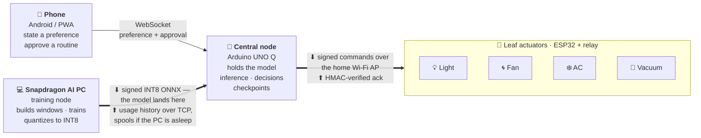

<div align="center">


# ÆON Home

### The Adaptive Memory Layer for Smart Homes

**A smart home that learns from you — not one you have to program.**

Built for the **Snapdragon Multiverse Hackathon 2026**, Qualcomm Noida.

[](LICENSE)
[](https://www.python.org/)
[](https://nodejs.org/)
[](https://onnxruntime.ai/)
[](https://aihub.qualcomm.com)

</div>

---

## Demo

<div align="center">

<a href="https://github.com/gtathelegend/AEON-HOME/raw/main/assets/aeon-home-demo.mp4">
  
</a>

### ▶ [Watch the 71-second demo](https://github.com/gtathelegend/AEON-HOME/raw/main/assets/aeon-home-demo.mp4)

</div>

---

## The problem

**Smart devices. None of them know you.**

A modern home already has the hardware. The light, the fan, the AC and the vacuum are all connected, all app-driven, all sitting on the same Wi-Fi. And yet:

| | |
|---|---|
| 🔆 | **The light doesn't know your evenings.** It waits for a tap, or runs a timer you set months ago. |
| 🌀 | **You turn the fan and AC on yourself.** Every day. The same way. At roughly the same time. |
| 🤖 | **The vacuum runs on a fixed timer** — whether the house is empty or full. |
| 📅 | **Nothing knows your daily schedule.** Four devices, four disconnected ideas of your life. |

Most smart homes just follow rules *you* set. They don't watch how you actually live.

The gap is **memory**. These devices generate a continuous stream of usage — every switch, every level change, every occupancy event — and then throw almost all of it away. Nothing accumulates. Nothing is consolidated into a picture of a household's rhythm. So the burden of noticing "we do this every evening" stays with the human, forever, and gets re-encoded by hand as a brittle rule.

Worse, what little state does exist is volatile. In much of India a 3–5 hour power cut is a daily event, and on the other side of it a device cold-boots from zero. Any learning it might have done is gone.

**So they stay connected — but they never learn you.**

## What we built

**One brain that learns your whole home.** It watches how you live, then offers it back — and nothing changes until you approve.

ÆON Home is an adaptive memory layer that sits underneath the appliances you already own. It runs entirely on your own hardware, on your own LAN.

| | | |
|---|---|---|
| **01** | **Observe** | Watches daily activity across every device — not just sensor readings, but what the household actually *did*: which appliance, what level, at what hour, with the room occupied or empty. |
| **02** | **Remember** | A private local memory. Usage is event-sourced into SQLite on the AI PC, and the node's live execution state is checkpointed continuously — so a power cut costs nothing. |
| **03** | **Learn** | Trains a behaviour model locally on the AI PC, from the accumulated usage rather than from rules you typed in. |
| **04** | **Suggest** | Proposes the routine it found. You approve. Only then does it deploy. |

### The self-training loop

```
COLLECT ──▶ FEEDBACK ──▶ TRAIN ──▶ REDEPLOY
   ▲                                    │
   └────────────────────────────────────┘
```

Usage accumulates continuously. When you ask it to learn, the hub pools everything it has recorded with everything you have stated, trains a fresh candidate, cross-validates it, scores it against the model currently running, and — if it wins — offers it for deployment. Every cycle runs on your own hardware, and nothing deploys until you approve.

That last clause is not a slogan. It is a disabled button: `REDEPLOY` stays greyed out until a candidate actually beats the incumbent, and even then a person has to press it.

---

## What it looks like

### The hub — AI PC dashboard

The whole system on one screen: live device state on the left, the model's provenance on the right, and every decision the house makes in the log at the bottom.


This is a real run, not a mockup. Reading it:

- **Devices** — four appliances with live state and the confidence behind each. They are labelled *"leaves · dumb actuators, no model"* on purpose: the intelligence lives in the central node, the leaves only switch loads.
- **Live log** — the audit trail. A spoken preference arrives and fans out to two destinations (`leaf ack 640 µs · pc delivered 779 µs`), then a training run, then a verified deployment.
- **Model panel** — version, cross-validated AUC, artifact size, and a cloud-bytes counter pinned at zero.
- **Candidate panel** — the freshly trained model scored against the live one, with per-device error deltas.

### The phone — speak once, approve once


State a preference in plain English — *"set the living room AC to 23 degrees."* You never say **when**. The hub already knows what hour it is and logs the preference against the current time, so the routine is learned from when you actually asked, not from a schedule you had to dictate.

Below the mic: direct sliders for every appliance, and the routines the system has learned so far.

### The retrain → redeploy pipeline, close up


The captured sequence, in order:

```
FANOUT  AC LIVING   leaf ack 640 µs · pc delivered 779 µs
        "set the living room AC to 23 degrees"
TRAIN   training a candidate on stated preferences + recorded behaviour
TRAIN   candidate trained: 2,592 windows, cv auc 1.000 vs 1.000 live,
        10,273 B int8 — ready to deploy
DEPLOY  10,273 B int8 ONNX -> sha256 verified -> ack v2,
        warm-start 24 steps x 4 devices
```

Every number there was produced by the run, not typed into a slide.

---

## Multi-device orchestration

The model is trained on the AI PC and **deployed to the central node**. The central node then runs inference locally and drives the appliances over the home Wi-Fi access point. The leaves never see a model.



**Why the model lives on the central node.** Putting inference on the node removes the PC from the control loop entirely. The laptop can be asleep, closed, or off — the house still behaves, because the node holds the model, the checkpoint and the schedule. The PC is a *training* node, not a dependency. If it is unreachable, usage history spools to local storage and replays when it comes back, so a preference is never lost to a sleeping laptop.

**Why the leaves stay dumb.** A leaf is a ~₹200 ESP32 with a relay. It has no model, no NPU and no runtime — it verifies a signature and switches a load. That keeps per-appliance cost near zero and means adding a fifth appliance costs nothing in intelligence. It also puts the security boundary in the right place: every command is signed, and a leaf rejects anything that fails HMAC verification, because an unsigned command on the home Wi-Fi is how a neighbour turns your AC on at three in the morning.

**One command, two destinations.** When you state a preference, the central node does two things at once: it dispatches to the leaf *now*, and it records the preference for training *later*. The leaf hop is deliberately measured without the PC round trip in it — awaiting the PC inside the leaf path pushed latency from 0.7 ms to 2 ms, so the code explicitly refuses to.

**Discovery is automatic.** The hub listens for `AEON?` on UDP `8801`, so the phone finds it on the LAN without anyone typing an IP address.

---

## The model

### What goes in — 106 features

Every inference reads a **24-hour rolling window**, not an instantaneous sensor value. That is the whole point: the system is learning *"this household turns the light warm after 8 PM"*, which is invisible to any model that only sees the present moment.

| Block | Size | Contents |
|---|---:|---|
| **Temporal window** | 96 | 24 hourly steps × 4 channels: `on` (0/1), `level` (normalised to −1…1), `occupancy` (0/1), `ambient` (`(°C − 28) / 8`) |
| **Context** | 6 | `sin/cos(hour)`, `sin/cos(day-of-week)`, `is_weekend`, ambient z-score |
| **Device identity** | 4 | one-hot over `ac.living`, `fan.bedroom`, `light.living`, `vacuum.home` |
| **Total** | **106** | a single `float32[1, 106]` tensor |

Levels are normalised per device from their real ranges: AC 16–30 °C, fan 0–100 %, light 2200–6500 K, vacuum 0–100 %.

### The network

Two heads sharing one input, trained separately and exported into a single ONNX graph:

```
                     ┌─→ Dense(106→32) → tanh → Dense(32→1) → sigmoid → p_on
  input[1, 106] ─────┤
                     └─→ Dense(106→32) → tanh → Dense(32→1) →         → level
```

| | |
|---|---|
| Framework | scikit-learn `MLPClassifier` + `MLPRegressor` |
| Hidden units | 32 per head, `tanh` |
| Optimiser | Adam, `tol=1e-5`, `n_iter_no_change=25`, `max_iter=3000` |
| L2 penalty | `alpha=1e-4` |
| **Parameters** | **6,914** — 2 × (106×32 + 32 + 32 + 1) |
| Export | hand-built ONNX graph, opset 13 — `MatMul → Add → Tanh → MatMul → Add [→ Sigmoid]` |

### What comes out

| Output | Shape | Meaning |
|---|---|---|
| `p_on` | `[1,1]` | probability the appliance should be on |
| `level` | `[1,1]` | normalised setting, denormalised to the device's own unit |

Those two numbers become an action through a **three-way confidence gate**, so the system distinguishes *knowing* from *guessing*:

| Confidence | Action | Behaviour |
|---|---|---|
| ≥ 0.75 | **act** | switch it, log it |
| ≥ 0.40 | **ask** | surface it, don't act |
| < 0.40 | **abstain** | stay quiet |

Two hard overrides run *after* inference and can only ever turn things **off**: an empty room forces `off_when_empty` devices off, and the automation consent switch withholds actuation entirely. Consent-off does not stop *learning* — preferences are still parsed and recorded, so switching automation back on resumes on a warm window rather than a blind one.

### Why this model

The obvious instinct is to reach for an LSTM or a small transformer, because this looks like a sequence problem. It isn't, quite — and the reasons it isn't are what make a 6,914-parameter network the right answer rather than a compromise.

**1 · The signal is periodic, and we hand the periodicity to the model directly.**
Household behaviour is dominated by two cycles: daily and weekly. Instead of asking a recurrent network to *discover* that structure from raw sequence, the feature builder supplies `sin/cos(hour)` and `sin/cos(day-of-week)` explicitly. Those four numbers encode "9 PM Tuesday is close to 9 PM Wednesday, and 23:59 is close to 00:01" — a fact an LSTM would burn capacity and data learning. Once periodicity is given, what remains is a fixed-width tabular problem, and an MLP is the correct tool for a fixed-width tabular problem.

**2 · The data is small, and it is one household's.**
This is the constraint that decides everything. A home produces a few thousand hourly windows, not millions of examples. A model with hundreds of thousands of parameters would have enough capacity to memorise a single household's history outright. At 6,914 parameters trained on ~2,600–6,000 windows, capacity and evidence are roughly matched — and the regularisation below pushes effective capacity well below the raw count.

**3 · We need a calibrated probability, not just a label.**
`p_on` is not thresholded at 0.5 and forgotten; it drives a 0.75 / 0.40 confidence gate that decides whether the house acts, asks, or stays quiet. A sigmoid output trained under log-loss gives a usable probability. Tree ensembles give a vote share, which looks like a probability and is not one. Calibration is a functional requirement here, not a nicety.

**4 · Two heads, one graph.**
The system must answer *should this be on?* and *at what setting?* from the same window. Two small nets sharing an input export to one ONNX file with two outputs — one artifact to sign, hash, ship and verify, instead of two that can drift out of sync.

**5 · One pooled model, not four.**
A 4-way one-hot lets a single network serve every appliance. That quadruples the data behind each parameter and lets patterns transfer — the evening occupancy signal that predicts the light also informs the AC. Four separate per-device models would each see a quarter of the data and share nothing.

**6 · Deployment physics.**
The artifact has to quantize to INT8, cross a home LAN, and load on a constrained node. At **10,273 bytes** it does all three trivially, and retraining finishes in **3.38 s** — fast enough that a person can press `RETRAIN`, watch it train, and press `REDEPLOY`, all inside a live demo. A model that takes ten minutes to retrain cannot participate in a consent loop, because nobody will wait for it.

### Why it won't overfit

Overfitting is the obvious failure mode for a model trained on one household, so the defences are layered — and most of them sit *outside* the network, in the deployment path:

**In the architecture**

- **Capacity ceiling.** One hidden layer, 32 units. There is no depth to memorise with.
- **L2 weight decay** at `alpha=1e-4` on both heads.
- **Convergence-based stopping.** Training halts when the loss stops improving by `tol=1e-5` for 25 consecutive iterations, rather than grinding through a fixed epoch count. An earlier build capped at 400 iterations, hit the ceiling every run, and shipped an under-trained model that still scored acceptably — which is exactly the kind of silent failure the gates below are designed to catch.
- **Feature engineering over capacity.** Every parameter spent on rediscovering "hours are cyclical" is a parameter available to memorise noise. Handing the model Fourier features means fewer parameters are needed for the same fit.
- **Pooling across devices** acts as a regulariser: the shared hidden layer must find structure that holds for four different appliances, which penalises device-specific memorisation.

**In the deployment gate — the part that actually protects the house**

A trained model is not a deployed model. Three checks stand between them:

| Gate | Threshold | What it catches |
|---|---|---|
| Enough data | ≥ 200 training windows | refuses to train a confident model on a week of noise |
| **Generalises** | 3-fold stratified **CV AUC ≥ 0.60** | measured on held-out folds — a memorised model scores well in-sample and fails here |
| **Beats the incumbent** | re-scores the *currently deployed* model on the *current* dataset and must win | the strongest guard: an overfit candidate loses to the running model on fresh data |

The third gate is the one worth dwelling on. It is not a fixed accuracy bar, which a model can clear while still being worse than what you already have. It re-runs the incumbent against today's data and demands the candidate beat it *there*. A model that has memorised yesterday's noise cannot win that comparison.

And then a human presses the button.

**A note on the AUC.** The cross-validated AUC in these screenshots reads 1.000, and it would be misleading to present that as real-world accuracy. It is high because the current training mix is dominated by synthesised preference data, which is internally consistent by construction. The number that carries operational weight is not the absolute AUC — it is the head-to-head against the incumbent, plus the per-device level error the candidate panel reports (AC 0.13 °C, fan 0.52 %, light 27.3 K, vacuum 0.89 %). As real observed behaviour accumulates, the absolute AUC will fall toward something honest, and the beats-incumbent gate keeps working regardless.

### How it is trained

Training data comes from two sources, pooled:

1. **Stated preferences** — every sentence you have spoken, expanded into 28 days × 24 hourly steps of intent.
2. **Observed behaviour** — what the appliances actually did, reconstructed from the event-sourced `usage` table in SQLite.

That mix is deliberate. Stated preferences give the model a clean signal on day one, when there is no history; observed behaviour progressively takes over as the house accumulates a record of itself.

---

## Quantization

Deployment artifacts are INT8, produced with ONNX Runtime's dynamic quantizer:

```python
from onnxruntime.quantization import QuantType, quantize_dynamic

quantize_dynamic(
    model_input=str(src),
    model_output=str(dst),
    weight_type=QuantType.QInt8,
)
```

Precisely: **weight-only, post-training dynamic quantization to signed INT8.** Activations are quantized at runtime, so no calibration set is required.

**Quantization is verified, not assumed.** Before an INT8 artifact is eligible to ship, it runs head-to-head against its FP32 parent:

| Check | What it compares |
|---|---|
| `max_p_on_delta` | worst-case probability drift |
| `mean_p_on_delta` | average probability drift |
| `max_level_delta` | worst-case level drift |
| `decisions_identical` | **do FP32 and INT8 produce the same on/off decisions?** |

The last one is what matters — a model that is numerically close but behaviourally different is not a safe swap.

Result: **~28 KB FP32 → ~10 KB INT8**, about a third of the size, with the decision surface held constant. The measured artifact was **10,273 bytes**.

---

## Qualcomm AI Hub

We use AI Hub to compile and profile the model on real Snapdragon silicon rather than guessing at its performance.

```python
compile_job = qai_hub.submit_compile_job(
    model=str(src),
    device=qai_hub.Device("Snapdragon X Elite CRD"),
    input_specs={"input": (1, 106)},
    options=f"--target_runtime {target_runtime}",
)
compiled = compile_job.get_target_model()
profile_job = qai_hub.submit_profile_job(model=compiled, device=device)
```

| | |
|---|---|
| Jobs used | `submit_compile_job`, `submit_profile_job` |
| Default target | `Snapdragon X Elite CRD` |
| Target runtimes | `onnx` · `tflite` · `qnn_lib_aarch64_android` · `qnn_context_binary` |
| Metrics pulled back | on-device inference time (µs), peak memory (MB), compute unit, compile + profile job IDs |

Two engineering details worth pointing at:

- **It runs in an isolated virtualenv.** `qai-hub` pins protobuf 6.x, which would downgrade the ONNX stack the hub depends on. AI Hub jobs are shelled out to a separate `.venv-aihub` rather than being allowed to break the runtime environment.
- **It never blocks the demo.** Profile jobs take minutes. They are dispatched as a detached task, results land in the dashboard when they arrive, and every failure path returns a reason instead of raising — the house keeps working whether or not AI Hub answers.

### Where inference runs

The runtime requests the Qualcomm execution provider first and falls back cleanly:

```python
PREFERRED_PROVIDERS = ["QNNExecutionProvider", "CPUExecutionProvider"]
```

On the Arduino UNO Q specifically, the QRB2210 has no Hexagon NPU, so inference there is CPU via ONNX Runtime — which the 6,914-parameter model is sized for.

---

## What we measure

From the run shown above:

| Metric | Value | Source |
|---|---|---|
| Command → leaf acknowledgement | **640 µs** | live log, per-command |
| Command → PC recorded | **779 µs** | live log, per-command |
| Checkpoint restore at boot | **2.17 ms** | hub boot log, warm start |
| Deployment → node ack | **21.2 ms** | `deployments` table |
| Training time | **3.38 s** | 2,592 windows, 6,914 params |
| Artifact size | **10,273 B** | SHA-256 verified on arrival |
| Cross-validated AUC | **1.000** | 3-fold stratified |
| Per-device level MAE | AC 0.13 °C · fan 0.52 % · light 27.3 K · vacuum 0.89 % | candidate scoring |
| **Cloud bytes** | **0** | live counter |

Also collected: inference latency percentiles (mean/p50/p95/p99) via `perf_counter` around the ORT call, plus real CPU/RAM utilisation and database size via `psutil`.

---

## Setup

Three components, independent of each other. **If you have 5 minutes, run the simulation hub — it is the whole demo and needs nothing but Python.**

### Prerequisites

| | Version | Needed for |
|---|---|---|
| Python | **3.11+** | hub, backend |
| Node.js | **20+** | React dashboard |
| Arduino IDE / `arduino-cli` | 2.x | physical hardware only |
| Android Studio | latest | native phone app only |

```bash
git clone https://github.com/gtathelegend/AEON-HOME.git
cd AEON-HOME
```

### 1 · Simulation hub — the demo ⭐

The full system: dashboard, phone client, training, quantization, deployment, checkpointing. No hardware, no cloud, no API keys.

```bash
cd simulation
python -m venv .venv

# Windows
.venv\Scripts\activate
# macOS / Linux
source .venv/bin/activate

pip install -r requirements.txt
python run.py
```

```
  ÆON HOME · HUB
  ────────────────────────────────────────────────────
  dashboard   http://localhost:8800/
  phone       http://192.168.1.42:8800/phone
  ────────────────────────────────────────────────────
  phase 2 · SQLite + TCP leaves + eMMC checkpoints in ./data/
  same WiFi, no cloud, no pairing
```

Open the dashboard on the PC and the phone URL on your phone — same Wi-Fi, nothing else to configure.

| Flag | Effect |
|---|---|
| `--port 8800` | change the port |
| `--reset` | wipe `data/` for a clean demo |
| `--phase 1` | scripted house — no sockets, no DB |
| `--phase 2` | **default** — SQLite, TCP leaves, real checkpoints |

<details>
<summary><b>Optional — enable Qualcomm AI Hub profiling</b></summary>

AI Hub needs its own virtualenv because `qai-hub` pins a conflicting protobuf:

```bash
cd simulation
python -m venv .venv-aihub

# Windows
.venv-aihub\Scripts\pip install -r requirements.txt qai-hub
# macOS / Linux
.venv-aihub/bin/pip install -r requirements.txt qai-hub

qai-hub configure --api_token <YOUR_TOKEN>   # from https://aihub.qualcomm.com
```

The hub picks the venv up automatically on the next retrain.

One-shot compile + profile without the hub running — note it must use the AI Hub interpreter:

```bash
# list the available Snapdragon targets
.venv-aihub\Scripts\python tools/aihub_optimize.py --devices

# train, export FP32 + INT8, then compile and profile on device
.venv-aihub\Scripts\python tools/aihub_optimize.py \
    --device "Snapdragon X Elite CRD" \
    --runtime qnn_context_binary \
    --out build
```

Runtimes: `onnx` (default) · `tflite` · `qnn_lib_aarch64_android` · `qnn_context_binary`. Add `--no-profile` to compile only.

</details>

### 2 · Backend + React dashboard

The larger FastAPI service and the full React UI (device pages, NPU panel, knowledge graph, architecture explorer).

```bash
# --- backend, from the repo root ---
python -m venv .venv
.venv\Scripts\activate          # Windows
source .venv/bin/activate       # macOS / Linux

pip install -r backend/requirements.txt
cp .env.example .env            # then set AEON_JWT_SECRET

python -m backend.aeon.main     # run from the REPO ROOT, not from backend/
```

| Service | URL |
|---|---|
| REST API | `http://localhost:8000` |
| OpenAPI docs | `http://localhost:8000/api/docs` |
| Dashboard WebSocket | `ws://localhost:8000/ws/dashboard` |
| Device WebSocket | `ws://localhost:8000/ws/device` |
| Prometheus metrics | `http://localhost:9090/metrics` |

Generate a signing secret before anything real:

```bash
python -c "import secrets; print(secrets.token_hex(32))"
```

```bash
# --- frontend ---
cd frontend
npm install
cp .env.example .env
npm run dev                     # Vite prints the URL
```

> **Note:** run the backend with `python -m backend.aeon.main` **from the repository root**. Several older docs say `cd backend && python -m aeon.main`; that form fails because `main.py` uses the root-relative import `backend.aeon.api.app`. Keep `backend/requirements.txt` in its own venv — it pins `websockets==13.1` while the simulation needs `>=14.0`, so **do not install both into the same environment.**

### 3 · Arduino firmware (physical hardware)

Wiring:

| Pin | Component |
|---|---|
| D2 | DHT11 temperature / humidity |
| D3 | HC-SR501 PIR motion |
| D4 | Push button (`INPUT_PULLUP`, "false alarm") |
| D5 | Status LED |
| D6 / D7 / D8 | L298N fan — ENA (PWM) / IN1 / IN2 |
| D9 | Piezo buzzer |
| D10 / D11 | SoftwareSerial ↔ ESP8266 @ 9600 baud |

```bash
arduino-cli lib install "DHT sensor library" "ArduinoJson"
arduino-cli compile --fqbn arduino:avr:uno firmware/firmware/sentinel
arduino-cli upload  -p COM3 --fqbn arduino:avr:uno firmware/firmware/sentinel
```

> ⚠️ `scripts/flash_arduino.sh` still points at a pre-refactor `arduino/` path and will fail. Use the `arduino-cli` commands above.

### 4 · Android app

```bash
cd android
cp local.properties.example local.properties   # add sarvam.key=... for voice
./gradlew installDebug
```

Launch, tap **HUB**, enter the AI PC's IP and port `8800`, Connect. The app builds and runs **without** a Sarvam key — the mic is simply disabled and everything else works.

---

## Usage

Once the hub is running:

| Do this | And watch |
|---|---|
| Say or type *"set the living room AC to 23 degrees"* on the phone | a `FANOUT` line in the live log with both delivery latencies |
| Press **RETRAIN** | a candidate trains and is scored against the live model |
| Read the **CANDIDATE** verdict | `BETTER` unlocks `REDEPLOY`; `NOT BETTER` keeps it disabled |
| Press **REDEPLOY** when unlocked | artifact size, SHA-256 verification and version bump in the log |
| Press **DISABLE AUTOMATION** | tiles switch to `held` — the model still learns, it just may not act |
| Pull the plug on the node, reconnect | checkpoint restore, with the restore time printed |
| Watch **CLOUD BYTES** | it stays at `0` |

You never state a time. The hub logs each preference against the hour you said it, and the learned routine appears in the **LEARNED** panel against that hour.

---

## Testing

```bash
# backend + integration suites (53 tests) — from the repo root,
# with the backend venv active
pytest tests -v

# simulation: shapes → synthesis → training → export → quantise → parity → inference
cd simulation
python -m pytest tests/test_phase2.py tests/test_phase3.py -v
```

`tests/test_deployment_pipeline.py` covers packaging and validation. `simulation/tests/test_phase3.py` is the one to read to see the ML path end to end, including the FP32↔INT8 parity assertion and a canary on the 6,914-parameter count.

---

## What works today

| | |
|---|---|
| ✅ | Simulation hub — dashboard, phone client, UDP discovery, live log |
| ✅ | 106-feature two-head model: train → ONNX → INT8 → parity-check → deploy |
| ✅ | Three-gate deployment safety (min windows · CV AUC · beats-incumbent) |
| ✅ | Model deployed to the central node; signed commands fanned out to leaf actuators |
| ✅ | HMAC-signed manifests, SHA-256 artifact verification, atomic write with rollback |
| ✅ | Checkpoint / restore with CRC-32 validation |
| ✅ | Store-and-forward usage spooling when the training PC is unreachable |
| ✅ | Qualcomm AI Hub compile + profile integration |
| ✅ | FastAPI backend, 57 routes, HMAC-authenticated device channel with replay protection |
| ✅ | NetworkX knowledge graph with identity export / import |
| ✅ | Arduino firmware: DHT11 + PIR + button sensing, LED / buzzer / L298N actuation |
| ✅ | EEPROM ping-pong checkpointing (AVR / ESP8266) |
| ✅ | ESP8266 gateway with a 10-deep offline queue |
| ✅ | Android app with Sarvam STT/TTS |

---

## Repository layout

```
AEON-HOME/
├── simulation/         ⭐ the demo — hub, dashboard, phone, model pipeline
│   ├── aeon/              tsmodel · sequence · central · leaf · pc · aihub · runner
│   ├── web/               dashboard.html · phone.html
│   └── tools/             aihub_optimize · aihub_job · preflight
├── backend/            FastAPI service — 57 routes, WebSocket gateway
├── frontend/           React 19 + TanStack Start dashboard
├── firmware/           Arduino UNO Q firmware (current)
├── legacy/arduino/     AVR + ESP8266 firmware (working EEPROM path)
├── android/            Kotlin / Compose app with Sarvam voice
├── core/ · aeon_platform/ · shared/    policy, learning, runtime, protocols
├── tests/              53 pytest tests
└── docs/               architecture, protocol and hardware references
```

---

## Team

| Role | Name | Email |
|---|---|---|
| **Team Lead** | Vedaang Sharma | vedaangsharma2006@gmail.com |
| Member | Kartik Kumar | kartikkuma9261@gmail.com |
| Member | Akshat Kasera | kaseraakshat07@gmail.com |
| Member | Ashwani Yadav | yadavashwani985@gmail.com |

---

## References

- [Qualcomm AI Hub](https://aihub.qualcomm.com) — compile and profile jobs
- [Qualcomm AI Engine Direct (QNN)](https://docs.qualcomm.com/bundle/publicresource/topics/80-62010-1/ai-app-development.html) — execution provider
- [ONNX Runtime quantization](https://onnxruntime.ai/docs/performance/model-optimizations/quantization.html) — dynamic INT8
- [Arduino UNO Q](https://www.qualcomm.com/developer/hardware/arduino-uno-q) — central node
- [Sarvam AI](https://www.sarvam.ai/) — `saaras:v3` STT, `bulbul:v2` TTS
- [DPDP Act 2023](https://www.meity.gov.in/data-protection-framework) — the privacy constraint we designed against

## License

[MIT](LICENSE) © 2026 Vedaang Sharma and the ÆON Home team.

<div align="center">
<br />

<br /><br />
<b>Teachable, not programmable.</b>
<br /><br />
<i>Built at the Snapdragon Multiverse Hackathon, Qualcomm Noida.</i>
</div>
