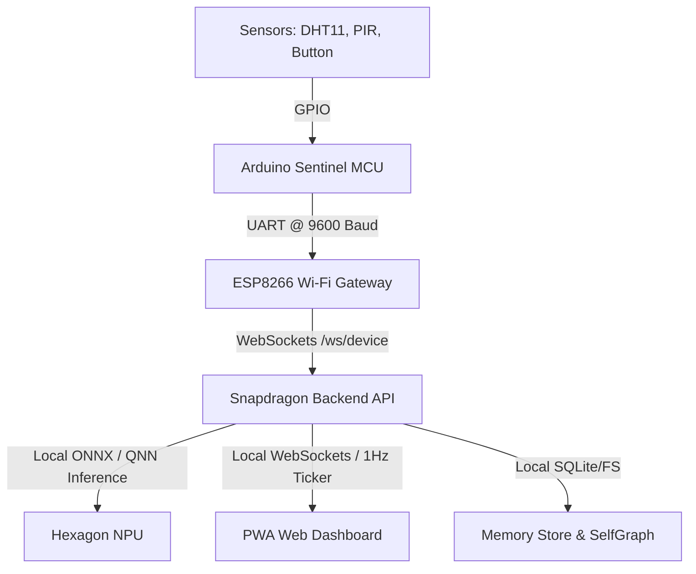

# ÆON Home — System Architecture & Data Specification

This document provides a comprehensive technical reference for the **ÆON Home Persistent Edge Intelligence Platform**. It covers all system features, live dashboard metrics, the Arduino-ESP8266 telemetry schema, firmware operations, and communication protocol details.

---

## 1. System Overview & Core Features

ÆON Home is a local-first, privacy-by-design smart home platform designed to run on the **Qualcomm Snapdragon X Elite Edge AI Engine**. It operates without cloud dependency and guarantees absolute user privacy under the Digital Personal Data Protection (DPDP) Act.



### Core Architecture Capabilities
*   **Persistent Edge Intelligence**: Survives power cuts and device reboots with zero state or history amnesia. System variables, rolling stats, and ML weights are checkpointed directly to the MCU's non-volatile EEPROM and loaded instantaneously (< 200 ms) upon power restoration.
*   **Zero-Cloud Privacy Assurance**: Guarantees **0 KB** of raw sensor telemetry leaves the local network. Raw sensor measurements are never uploaded. Instead, they are processed locally and validated using cryptographically signed **Capability Tokens**.
*   **Immediate On-Device Adaptation**: If a false alarm occurs, pressing the physical button on the MCU or clicking "Mark False Alarm" on the dashboard decreases the anomaly sensitivity threshold ($\theta$) by $0.05$ immediately, persisting it to EEPROM.
*   **Background Dream State Overnight Optimization**: When idle or during "Night Mode", the Snapdragon NPU replays historical sensor sequences, compiles optimized local datasets, and recalibrates model weights to optimize latency and false-alarm sensitivity.
*   **Portable Cognitive Identity**: User profiles, habits, and preferences are stored in an encrypted local Knowledge Graph (`SelfGraph`). The identity can be migrated peer-to-peer to another Snapdragon node via QR codes and biometric verification.
*   **Sarvam AI Voice Interface**: Local voice interaction in Indian languages (Hindi, English, Tamil) processed at the edge.

---

## 2. Dashboard Telemetry & UI Screens

The frontend PWA dashboard receives a real-time system state telemetry payload from the backend WebSocket server (`WebSocketBus` on port `8001`) at a **1 Hz frequency**.

### A. Telemetry Data Schema (1 Hz Broadcast)
The backend constructs and pushes the following JSON object to the dashboard:

```json
{
  "serialStatus": {
    "connected": true,
    "port": "COM4 / Wi-Fi Gateway",
    "baud": 9600,
    "frameRate": 420,
    "eepromUsagePct": 25,
    "lastCheckpointSec": 2,
    "temperature": 24.5,
    "humidity": 60.0,
    "motionState": "Detected"
  },
  "snapdragonStatus": {
    "connected": true,
    "npuActive": true,
    "modelName": "sentinel_anomaly_detector.onnx",
    "latencyMs": 1.2,
    "throughputFps": 120,
    "memoryMb": 0,
    "tokensVerified": 840,
    "powerState": "1.8W (estimated)",
    "executionProvider": "QNN_HTP",
    "cpuPct": 15.4,
    "npuPctEstimated": 45.0
  },
  "continuousLearning": {
    "progressPct": 87,
    "falseAlarmsFlagged": 3,
    "sensitivityThreshold": 0.725,
    "lastAdaptationSec": 1500,
    "status": "idle",
    "lastTrainingTs": "2026-07-17T04:00:00Z"
  },
  "dreamState": {
    "active": false,
    "eventsReplayed": 1024,
    "compressionPct": 0,
    "beforeLatencyMs": 5.4,
    "afterLatencyMs": 1.2,
    "lastRunTime": "2026-07-17T02:00:00Z",
    "lastResult": "success"
  },
  "voiceAssistant": {
    "sarvamConnected": true,
    "language": "en-IN",
    "isListening": false,
    "isSpeaking": false,
    "lastQuery": "turn off warning light",
    "lastResponse": "Status LED turned off."
  },
  "privacyMesh": {
    "rawBytesSent": 0,
    "capabilityTokensIssued": 1680,
    "lastAuditSec": 2,
    "auditLog": [
      {
        "time": "17:02",
        "token": "EVT-123",
        "event": "ANOMALY / temperature_spike",
        "status": "VERIFIED"
      }
    ]
  },
  "knowledgeGraph": {
    "nodesCount": 12,
    "edgesCount": 24,
    "lastNodeAdded": "Thermal Comfort Policy"
  },
  "migrationState": {
    "status": "idle",
    "qrCodePayload": "aeon://identity/v1/export?device=snapdragon-node-01",
    "targetDeviceId": "Awaiting scan"
  },
  "systemMeta": {
    "deviceId": "snapdragon-node-01",
    "uptime": 7200,
    "wsClients": 1,
    "totalFrames": 42000
  }
}
```

### B. UI Views & Features

1.  **Overview**: Displays live system status, NPU execution provider, quick stats (NPU Latency, EEPROM Usage, On-Device Adaptation, 0 KB Raw Data Transmitted), the real-time activity stream timeline, and the System Node Mesh.
2.  **Onboarding**: Guides users through local hardware setup: pairing Arduino over USB UART, verifying zero raw data leakage, local identity generation, and testing the Sarvam voice engine.
3.  **Arduino Serial**: Renders UART interface statistics, EEPROM allocation, baud rate, and live metrics (Ambient Temp, Relative Humidity, Motion).
4.  **Snapdragon NPU**: Details compute status, execution provider fallback (QNN HTP NPU $\rightarrow$ CPU, ONNX Runtime), inference latency in milliseconds, frame rate, CPU utilization, and estimated NPU load.
5.  **Sarvam Voice**: Microphone recorder control allowing queries and responses in Hindi, English, and Tamil. Renders raw speech transcription logs (STT/TTS inputs).
6.  **Privacy Audit**: Cryptographic proofs showing that no raw bytes leave the device, radial graphs of local execution ratio (100%), and a table of signed Capability Tokens (`EVT-` IDs).
7.  **Knowledge Graph**: Displays an interactive topological layout showing the connections between nodes (Portable Identity, Living Room, Comfort Policy, Motion Anomaly Model, and Dream Optimization rules).
8.  **Identity Migration**: P2P migration screen. Shows a QR code containing encrypted graph credentials. Provides a camera scanner to scan a target node's QR code and trigger biometric verification before local sync.
9.  **Dream State & Adapt**: Panel containing controls to trigger background optimization. Renders a progress pipeline tracking the compilation and deployment stages. Contains a bar chart comparing before/after inference latency.
10. **System Nodes**: Node grid status cards showing connectivity, firmware version, and device parameters.
11. **Alert Mesh**: Verifiable, audit-proven signed event logs grouped by severity (ANOMALY: High, SYSTEM: Medium, COMMAND: Medium, USER_CORRECTION: Low). Allows users to press "Mark False Alarm" to resolve warnings.
12. **Live Metrics**: Interactive area and line charts plotting ambient temperature history and EEPROM memory write allocation over the last 60 minutes.
13. **Settings**: Forms to modify local preferences, EEPROM write intervals, language models, and PWA cached files.
14. **Persistent Pulse**: State recovery monitoring showing boot recovery metrics, wear-leveling health, and total processed capability tokens.

---

## 3. Data Exchanged with Arduino Sentinel

The system uses a JSON-based serial communication protocol over a 9600-baud SoftwareSerial connection.

### A. Arduino $\rightarrow$ Snapdragon (Outbound)

#### 1. Sensor Update (`sensor_update`)
Sent every 500 ms. Details raw temperature, humidity, motion state, and active model version.
```json
{
  "protocol_version": 1,
  "typ": "sensor_update",
  "device_id": "sentinel-01",
  "sequence": 1405,
  "temp": 24.5,
  "humidity": 60.2,
  "motion": 1,
  "model_v": 1
}
```

#### 2. Uptime Heartbeat (`heartbeat`)
Sent every 5 seconds (every 10 sensor updates) to confirm connection integrity.
```json
{
  "protocol_version": 1,
  "typ": "heartbeat",
  "device_id": "sentinel-01",
  "sequence": 1410,
  "uptime_ms": 70500,
  "model_v": 1
}
```

#### 3. Physical Button Event (`feedback_event`)
Triggered instantly when the false alarm/dismissal button (Pin 4) is pressed.
```json
{
  "typ": "feedback_event",
  "device_id": "sentinel-01",
  "event": "false_alarm"
}
```

#### 4. Boot Recovery Status (`memory_status`)
Sent once at boot time. Tells the backend whether the state was restored from EEPROM or loaded from default values.
```json
{
  "typ": "memory_status",
  "device_id": "sentinel-01",
  "status": "restored", 
  "model_v": 1,
  "checksum_valid": true
}
```

---

### B. Snapdragon $\rightarrow$ Arduino (Inbound Commands)

#### 1. Sensitivity Adaptation Update (`policy_update`)
Adjusts the local temperature anomaly detection threshold ($\theta$). Persists to EEPROM.
```json
{
  "typ": "policy_update",
  "theta": 32.50,
  "command_id": "cmd_987",
  "seq": 15
}
```
*   **Arduino Response (ACK)**: `{"typ":"policy_ack","command_id":"cmd_987"}` and sounds beep code 1.

#### 2. ML Model Context Sync (`model_update`)
Flashed to Arduino when the continuous learning loop deploys a newly trained model iteration.
```json
{
  "typ": "model_update",
  "model_v": 2,
  "mean": 23.41,
  "std": 1.25,
  "theta": 31.80,
  "command_id": "cmd_990",
  "seq": 16
}
```
*   **Arduino Response (ACK)**: `{"typ":"model_ack","command_id":"cmd_990","model_v":2,"status":"applied"}` and sounds beep code 2.

#### 3. Relay and Light Control (`relay_set`)
Direct control over the Warning/Status LED pin.
```json
{
  "typ": "relay_set",
  "state": true,
  "seq": 17
}
```

#### 4. Piezo Buzzer Feedbacks (`buzzer`)
Sounds the buzzer to alert user of system changes.
```json
{
  "typ": "buzzer",
  "duration": 200,
  "seq": 18
}
```

#### 5. Force Memory Save (`checkpoint`)
Triggers an immediate EEPROM commit on the Arduino.
```json
{
  "typ": "checkpoint",
  "seq": 19
}
```

---

## 4. Hardware Pinout & Wiring

The Arduino Sentinel controls the physical interfaces of the edge sensor node:

| Hardware Component | Arduino PIN | I/O Type | Description |
| :--- | :--- | :--- | :--- |
| **DHT11 Data** | Pin 2 | Input | Humidity and temperature sensing |
| **HC-SR501 PIR Out** | Pin 3 | Input | Digital motion sensor (HIGH = Motion) |
| **False Alarm Button** | Pin 4 | Input (Pullup) | Physical button (LOW = Pressed) |
| **Status LED** | Pin 5 | Output | Status/Warning light indicator |
| **Relay 1** | Pin 7 | Output | General purpose power switch |
| **Relay 2** | Pin 8 | Output | General purpose power switch |
| **Piezo Buzzer** | Pin 9 | Output | Audible notifications via `tone()` |
| **SoftwareSerial RX** | Pin 10 | Input | Receives data from ESP8266 TX |
| **SoftwareSerial TX** | Pin 11 | Output | Sends data to ESP8266 RX |

---

## 5. Firmware Implementations

The firmware uses modular C++ design to maintain speed, safety, and stability on the Arduino.

### A. Arduino Sentinel Sketch (`sentinel.ino`)
The loop checks the current time at $2$ Hz ($500$ ms intervals), reads raw DHT11/PIR values, and performs feature extraction:
```cpp
void loop() {
    uint32_t now = millis();

    // 1. Sample sensors & extract features
    if (now - g_last_sample >= SENSOR_SAMPLE_MS) {
        g_last_sample = now;
        sensors_read(&g_reading);
        features_update(&g_frame, &g_reading);
        
        protocol_send_sensor_update(&g_reading, g_state.seq++, g_state.model_v);
        
        if (g_state.seq % 10 == 0) {
            protocol_send_heartbeat(g_state.seq, g_state.model_v);
        }
        
        policy_evaluate(&g_reading);
    }

    // 2. Checkpoint state to EEPROM (Power-loss resilience)
    if (now - g_last_checkpoint >= CHECKPOINT_INTERVAL_MS) {
        g_last_checkpoint = now;
        g_state.timestamp = now;
        checkpoint_save(&g_state);
    }

    // 3. Process inbound commands from Snapdragon
    protocol_update();
}
```

*   **EEPROM Double Slot (Ping-Pong Storage)**: To prevent flash wear and avoid corruption during power cuts, two storage slots are used at address `0` and `sizeof(slot)`. The slot is verified using a custom **CRC32** calculation. If valid, the state is restored at boot; otherwise, defaults are loaded.
*   **Local Fallback Control**: If the Snapdragon PC is offline, the Arduino uses local rules. If the button (Pin 4) is pressed, it suppresses alert LEDs, sets motion/temp flags, and transmits a `feedback_event` over UART.

### B. ESP8266 Wireless Gateway
The gateway sits as a transparent, high-performance link between the Arduino (UART at 9600 baud) and the Snapdragon Backend API (WebSockets).

*   **Pins**: SoftwareSerial on Pin 14 (D5/RX) and 12 (D6/TX).
*   **WebSockets**: Uses the `WebSocketsClient` library to maintain a persistent connection to `ws://BACKEND_HOST:BACKEND_PORT/ws/device`.
*   **Gateway Registration**: Renders registration status upon connection:
    `{"typ":"gateway_register","gateway_id":"aeon-esp-01","device_id":"sentinel-01","transport":"uart_wifi","firmware_version":"1.0.0"}`
*   **Offline Queue**: Prevents data loss during Wi-Fi disconnects. Holds up to **10 JSON messages** (256 bytes max) in a ring buffer (`offlineQueue`). Messages are automatically flushed in order once Wi-Fi and WebSocket connections are restored.
*   **Keepalive Heartbeats**: Periodically sends a `gateway_status` payload every 30 seconds, including the WiFi RSSI signal strength and whether the Arduino UART has responded within the last 60 seconds.

---

## 6. Serial Data Parsing Mechanics

Data is parsed asynchronously in both directions:

### A. Arduino JSON Decoder
Using the `ArduinoJson` library, incoming UART bytes from the ESP8266 are read character-by-character into `rx_buffer` until a line feed (`\n`) is parsed:
```cpp
void protocol_receive_byte(uint8_t b) {
    if (b == '\n' || b == '\r') {
        if (rx_index > 0) {
            rx_buffer[rx_index] = '\0';
            aeon_on_command(rx_buffer);
            rx_index = 0;
        }
    } else {
        if (rx_index < AEON_MAX_PAYLOAD) {
            rx_buffer[rx_index++] = b;
        } else {
            rx_index = 0; // Drop overflow
        }
    }
}
```
The deserialized command is dispatched to `policy_update` for matching.

### B. Backend WebSocket Listener
FastAPI mounts a WebSocket endpoint `/ws/device`:
1.  **Attach**: Registers the connected websocket to the `SerialWriter`.
2.  **Telemetry Pump**: Receives line-terminated JSON strings.
3.  **Router**:
    *   Decodes `sensor_update` JSON to create a `FeatureFrame` struct and calls `sensor_processor.on_feature_frame()`.
    *   Decodes status updates and ACKs to create `AeonEvent` objects and calls `event_processor.on_event()`.
4.  **Detach**: Clears the websocket registry when the socket closes.

---

## 7. Alternative Binary Serial Protocol

For resource-constrained setups where JSON text is too expensive, the libraries include an alternate binary serial protocol layout.

### A. Frame Structure (Little-Endian)
```
+---------------+---------------+---------------+-------------------+---------------+---------------------+-----------------+
| Magic0 (0xAE) | Magic1 (0x01) | Type (1 Byte) | Sequence (4 Bytes)| Length(2 Bytes) | Payload (Len Bytes) | CRC16 (2 Bytes) |
+---------------+---------------+---------------+-------------------+---------------+---------------------+-----------------+
```
*   **Frame Types**:
    *   `0x01` (`FEATURE_FRAME`): Raw and statistical features.
    *   `0x02` (`EVENT`): State change notifications.
    *   `0x10` (`COMMAND`): Actuator and config command updates.
    *   `0xFF` (`ACK`): Acknowledgment signals.

### B. Python Frame Parsing State Machine
The backend uses a byte-oriented state machine (`FrameParser.feed()`) to parse binary streams, validating incoming packets using a CRC-16 (CCITT-FALSE) algorithm (`poly=0x1021`, `init=0xFFFF`):

```python
class _State(IntEnum):
    MAGIC0 = 0
    MAGIC1 = 1
    TYPE   = 2
    SEQ    = 3
    LEN    = 4
    PAYLOAD = 5
    CRC    = 6
```
Once the packet is verified, the parser converts the payload into Python classes using the `struct.Struct("<ffBBfffI")` descriptor. This maps raw bytes directly to floats, integers, and booleans.
