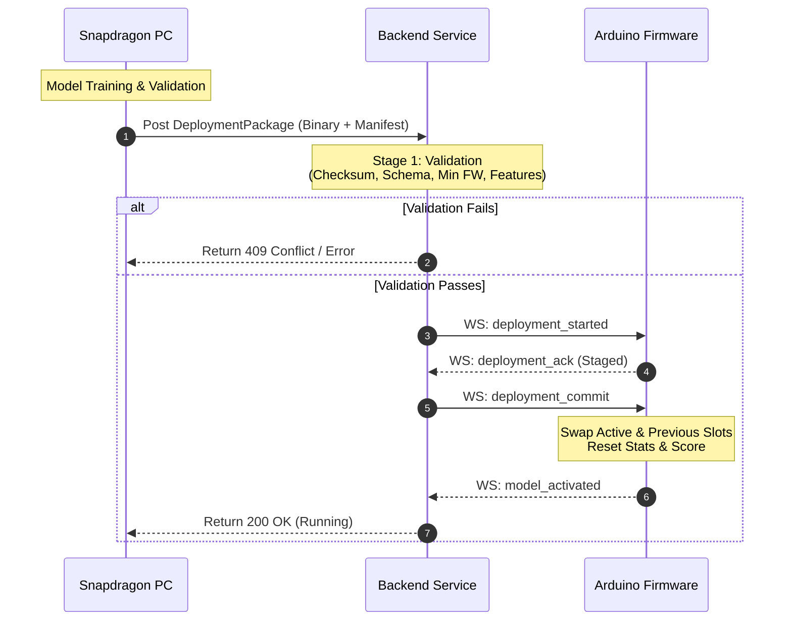

# ÆON Model Deployment & Lifecycle Pipeline

This document describes the model deployment, verification, and rollback lifecycle that bridges the Snapdragon PC (trainer and deployment coordinator) and the Arduino UNO Q (inference edge node).

---

## 1. Lifecycle Overview

The ÆON model lifecycle enforces a strict separation of concerns:
- **Snapdragon PC**: Responsible for training, dataset consolidation, validation, exporting to `.onnx`/`.bin` format, packaging, and initiating deployments.
- **Arduino UNO Q**: Loaded with the model, performs inference, scores output confidence, monitors telemetry, collects samples, and triggers self-initiated rollbacks if model performance decays.



---

## 2. Package Compilation (`DeploymentPackager`)

When a model completes training, the `DeploymentPackager` assembles the deployment artifacts into a single `DeploymentPackage`:

1. **Weight / Binary Resolution**: Searches the model directory for `<model_name>.bin` (or `.onnx` / `.pkl`).
2. **SHA-256 Checksumming**: Computes the cryptographic checksum of the raw binary to prevent transfer corruption.
3. **Metadata Generation**: Stamps the package with:
   - `model_id` and unique `package_id`.
   - Sequential `version` integer (managed via registry).
   - ISO-8601 timestamps (`training_timestamp`, `deployment_timestamp`).
   - compatibility specifications (`input_schema_version`, `output_schema_version`, `min_fw_version`).
4. **Feature Declaring (`FeatureCompatibility`)**: Declares the exact subset of features the model expects. For the default z-score temperature model, this includes:
   `["temperature", "humidity", "motion", "door_open", "mean_temp", "var_temp", "delta_motion"]`.
5. **HMAC Signature**: Stamps a security HMAC stub.

---

## 3. Server-Side Validation (`DeploymentValidator`)

Before any package is pushed to the edge node, the `DeploymentService` passes the package through the `DeploymentValidator`. If any check fails, the deployment is aborted immediately:

- **Integrity Check**: Recomputes the SHA-256 checksum of the uploaded binary and compares it to the manifest checksum.
- **Completeness Check**: Asserts that all metadata fields are present and non-empty.
- **Schema Compatibility**: Verifies that the model's input/output schema versions exactly match the runtime schema version (currently `1`).
- **Firmware Version Requirement**: Compares the active firmware version against the model's `min_fw_version` using a semver comparison parser.
- **Feature Compatibility**: Ensures that all features declared as `required_features` by the model are registered as active and available on the firmware.

---

## 4. WebSocket Deployment Protocol

The backend communicating with the firmware uses standard WebSocket JSON frames.

### 4.1 `deployment_started` (Outbound)
Sent to the firmware to stage the new model parameters.
```json
{
  "type": "deployment_started",
  "ts": "2026-07-19T00:45:00Z",
  "payload": {
    "deployment_id": 14,
    "model_id": "presence_classifier",
    "version": 3,
    "checksum": "d5a8f4c...",
    "feature_version": "v1"
  }
}
```

### 4.2 `deployment_ack` (Inbound)
Firmware acknowledges that it parsed and staged the candidate model parameters.
```json
{
  "typ": "deployment_ack",
  "device_id": "sentinel_01",
  "deployment_id": "14",
  "status": "received",
  "ts_ms": 124850
}
```

### 4.3 `deployment_commit` (Outbound)
Sent by the backend to trigger activation of the staged model.
```json
{
  "type": "deployment_commit",
  "ts": "2026-07-19T00:45:02Z",
  "payload": {}
}
```

### 4.4 `model_activated` (Inbound)
Firmware signals that the candidate model is now the active running model, and stats have been reset.
```json
{
  "typ": "model_activated",
  "device_id": "sentinel_01",
  "model_v": 3,
  "deployment_id": "14",
  "ts_ms": 125120
}
```

---

## 5. Rollback Mechanisms

To ensure system stability, ÆON supports two rollback mechanisms to return the edge node to the last known working model version:

### 5.1 Manual Rollback (Operator Initiated)
Operators can invoke `POST /api/v1/models/rollback` to force the edge node to revert to the previous model. The backend issues a `deployment_rollback` frame to the firmware, which restores the previous model parameters in `ModelRuntime` and saves a flash checkpoint.

### 5.2 Automatic Rollback (Firmware Self-Initiated)
If the firmware's `RollbackManager` detects a critical drop in runtime health (e.g. composite score < 0.30, error rate > 30%, or latency > 500ms), it automatically:
1. Reverts `ModelRuntime` parameters to the previous model slot.
2. Emits a `model_rolled_back` message over WebSocket.
3. Saves a persistent checkpoint to flash so the rollback survives reboots.

#### `model_rolled_back` (Inbound)
```json
{
  "typ": "model_rolled_back",
  "device_id": "sentinel_01",
  "model_v": 2,
  "reason": "low_score",
  "ts_ms": 284050
}
```
Upon receiving this message, the backend updates the active model registry to match the rolled-back version.
