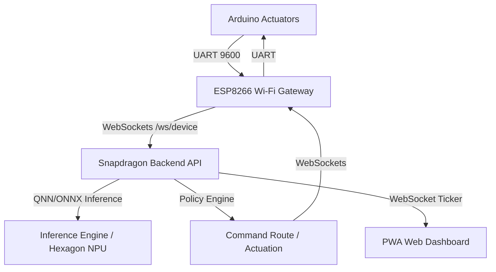

# ÆON Home — Repository Migration Plan

This document details the architectural audit and step-by-step migration plan to transition the ÆON Home repository from the legacy **Arduino + ESP8266 Gateway** architecture to the **Arduino UNO R4 WiFi (UNO Q) Central Node + Snapdragon AI PC (Training Node)** topology.

---

## 1. Architectural Comparison

### A. Current Architecture (Legacy)
In the legacy architecture, the Snapdragon PC sits directly in the real-time sensor-actuator loop:

*   **Problems**: High latency variance, dependency on Snapdragon PC availability for basic real-time automation, redundant ESP8266 hop, lack of modularity.

### B. Target Architecture (Modular Subsystems)
The target architecture removes the Snapdragon AI PC from the real-time control loop and shifts intelligence to the Arduino UNO Q:
```mermaid
graph TD
    subgraph Local Control Loop (Real-Time)
        Phone[Mobile Client / Dashboard] <-->|WebSockets| UNO[Arduino UNO Q Central Node]
        UNO -->|Direct IO / Local Protocol| Leaf[Leaf Devices]
        UNO -->|Local Inference & Policy| UNO
    end
    subgraph Offline Analytics & Optimization
        UNO -->|Forward Commands & Telemetry| PC[Snapdragon AI PC]
        PC -->|User Profile & SelfGraph| PC
        PC -->|Dream State Retraining| PC
        PC -->|Deploy New Models| UNO
    end
```

---

## 2. Dependency Graph & Coupling Analysis

Below is the dependency graph mapping current modules, imports, APIs, and firmware structures.

```mermaid
graph TD
    main[backend/aeon/main.py] --> api[backend/aeon/api/app.py]
    main --> policy[backend/aeon/policy/engine.py]
    main --> loop[backend/aeon/learning/loop.py]
    main --> graph[backend/aeon/graph/knowledge_graph.py]
    main --> ws_bus[backend/aeon/websocket/bus.py]
    main --> qnn[backend/aeon/qnn/manager.py]
    
    api --> routes[backend/aeon/api/routes/*.py]
    routes --> gateway_rt[backend/aeon/api/routes/gateway.py]
    
    gateway_rt --> parser[backend/aeon/serial/parser.py]
    gateway_rt --> sensor_proc[backend/aeon/sensors/processor.py]
    gateway_rt --> event_proc[backend/aeon/events/processor.py]
    
    policy --> qnn
    policy --> graph
    policy --> ws_bus
    policy --> serial_writer[backend/aeon/serial/writer.py]
    
    loop --> trainer[backend/aeon/learning/trainer.py]
    loop --> dream[backend/aeon/learning/dream.py]
    loop --> versioning[backend/aeon/learning/versioning.py]
    
    firmware[arduino/firmware/sentinel] --> libs[arduino/libraries/*]
    gateway_fw[arduino/esp8266/aeon_wireless_gateway] -->|UART| firmware
```

### Identified Couplings That Will Break & Resolutions

1.  **FastAPI `/ws/device` WebSocket Route**:
    *   *Current Coupling*: The `device_gateway` websocket (in `backend/aeon/api/routes/gateway.py`) accepts connections from the ESP8266, receives sensor frames, and passes them to `SensorProcessor` and `EventProcessor` which trigger `PolicyEngine` to run QNN/ONNX inferences on the PC and push actuation commands back via the websocket client registry.
    *   *Breaking Point*: The ESP8266 gateway is being deprecated. The Arduino UNO Q will now directly connect to the network. More importantly, the Snapdragon PC will no longer send real-time actuation commands down this socket.
    *   *Resolution*: Convert `/ws/device` into a **telemetry ingestion-only** channel. The Snapdragon PC receives telemetry and commands for logging to SQLite and training, but never sends real-time actuation commands back.

2.  **Arduino Sentinel Inference Logic**:
    *   *Current Coupling*: The firmware in `sentinel.ino` only evaluates basic threshold rules (`policy_evaluate`) and depends on the Snapdragon PC to run the ML anomaly detection/presence models.
    *   *Breaking Point*: Moving to a local on-device inference model on the UNO Q.
    *   *Resolution*: Port a lightweight ONNX/C++ inference runtime or mathematical equivalent to the UNO Q firmware. Create a clean device state and policy coordinator in C++ on the UNO Q.

3.  **Knowledge Graph & SelfGraph**:
    *   *Current Coupling*: Preferences are globally resolved, and context logic is tightly coupled to Python networkx graphs on the Snapdragon PC.
    *   *Breaking Point*: The UNO Q needs to run the Context Engine locally, but the primary SelfGraph stays on the Snapdragon PC.
    *   *Resolution*: Introduce a synchronization contract (e.g. JSON-based policy sync payload) where the Snapdragon PC exports synthesized rules/preferences and deploys them to the UNO Q's Context Engine and registry.

---

## 3. Subsystem Restructuring

### A. Folder Changes

| Current Path | Target Path | Action / Rationale |
|---|---|---|
| `arduino/firmware/sentinel/` | `firmware/central_node/` | Move and rename. This becomes the UNO Q firmware. |
| `arduino/libraries/` | `firmware/libraries/` | Move libraries for UNO Q compilation. |
| `arduino/esp8266/` | *Deleted* (archived) | ESP8266 gateway is obsolete; WiFi is native on UNO Q. |
| `backend/aeon/` | `backend/` | Flatten Python backend to reside directly at `/backend`. |
| `deploy/` & `deployment/` | `tools/deploy/` | Consolidate deployment scripts. |
| `frontend/` | `frontend/` | Keep React code under frontend/ but wire websocket to UNO Q for control. |
| *New* | `android/` | Dedicated Android mobile client code structure. |
| *New* | `simulations/` | Virtual appliance simulation engine (AC, Light, Vacuum). |
| *New* | `models/` | Store `.onnx` and `.bin` model artifacts. |
| *New* | `datasets/` | Store training and optimization dataset logs. |
| *New* | `architecture/` | Centralized system design and topology diagrams. |

---

## 4. Migration Order (Incremental & Buildable)

To ensure the repository remains fully buildable at every step, we will execute the migration in the following strict order:

```
┌────────────────────────────────────────┐
│ Phase 1: Folder Structure Setup        │ (Create directories, move/consolidate files)
└───────────────────┬────────────────────┘
                    │
                    ▼
┌────────────────────────────────────────┐
│ Phase 2: Firmware Porting & Cleanup    │ (Migrate Sentinel -> Central Node, remove ESP8266)
└───────────────────┬────────────────────┘
                    │
                    ▼
┌────────────────────────────────────────┐
│ Phase 3: Backend Flattening            │ (Flatten backend/aeon to backend/, fix imports)
└───────────────────┬────────────────────┘
                    │
                    ▼
┌────────────────────────────────────────┐
│ Phase 4: User Profile & Context Engines│ (Add User Profile Engine, expand Context Engine)
└───────────────────┬────────────────────┘
                    │
                    ▼
┌────────────────────────────────────────┐
│ Phase 5: Virtual Appliance Simulations │ (Implement sims under simulations/)
└───────────────────┬────────────────────┘
                    │
                    ▼
┌────────────────────────────────────────┐
│ Phase 6: Android Skeleton Setup        │ (Structure the android/ folder modules)
└────────────────────────────────────────┘
```

### Detailed Execution Steps

### Phase 1: Folder Structure Setup
1. Create new top-level directories: `firmware/`, `android/`, `simulations/`, `models/`, `datasets/`, `architecture/`, `tools/`.
2. Move `arduino/libraries` to `firmware/libraries`.
3. Move `arduino/firmware/sentinel` to `firmware/central_node`.
4. Remove `arduino/` folder.
5. Move `deploy/` and `deployment/` contents to `tools/deploy`. Remove legacy folders.
6. Verify no build tasks break.

### Phase 2: Firmware Porting & Cleanup
1. Refactor `firmware/central_node` to target UNO Q (incorporate WiFi libraries instead of SoftwareSerial).
2. Integrate a local C++ inference stub or matrix solver mimicking the ONNX model inputs/outputs.
3. Setup local context evaluator and store-and-forward queue in C++.

### Phase 3: Backend Flattening & Ingestion Refactor
1. Move files from `backend/aeon/*` to `backend/`.
2. Update all imports from `from aeon.xxx import yyy` to `from xxx import yyy`.
3. Modify `backend/api/routes/gateway.py` device websocket to stop sending real-time actuation commands, establishing the PC's role as a training/analytics node.
4. Verify backend launches and tests pass: `pytest backend/tests/`.

### Phase 4: User Profile & Context Engines
1. Implement `backend/learning/user_profile.py` for user-specific habits (temperatures, lighting).
2. Implement expanded Context model (ambient light, weekday, weekend, activity, home states) on both backend and central node protocols.

### Phase 5: Virtual Appliance Simulations
1. Implement simulations for Smart AC, Smart Light, and Robot Vacuum under `simulations/`.
2. Ensure each simulation exposes state, events, telemetry, and adaptation interfaces.

### Phase 6: Android Skeleton Setup
1. Create the `android/` directory and stub the `app/`, `voice/`, `notifications/`, `ws/`, `preferences/`, and `ui/` packages.

---

## 5. Risk Analysis & Compatibility

*   **Risk**: UNO Q SRAM exhaustion. UNO R4 WiFi has 32KB SRAM, which is plenty for basic policies and light neural networks but cannot support full standard ONNX models.
    *   *Mitigation*: Ensure ONNX models are compiled/compressed to quantized stubs or regression trees, or run a lightweight C++ matrix inference equivalent.
*   **Risk**: Pathing and import failures in existing tests.
    *   *Mitigation*: We will execute a global import search-and-replace using `multi_replace_file_content` during the flattening phase and update `sys.path` in `conftest.py`.
